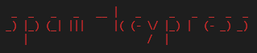

# spam-keypress

[](https://travis-ci.org/labarilem/spam-keypress)
[](https://snyk.io/test/github/labarilem/spam-keypress?targetFile=package.json)
[](https://badge.fury.io/js/spam-keypress)



Node.js CLI that spams OS keypress events.

## Installation

Install the CLI by running this command:

```bash
npm i -g spam-keypress
```

## Usage

```plain
Usage: spam-keypress [options] <keys>

Spams OS keypress events.
You can specify special keys by enclosing the key name in '@' characters. Example:
$ spam-keypress "abc@enter@"

Options:
  -V, --version        output the version number
  -w, --wait [ms]      Time to wait before starting to spam. Expressed in milliseconds. (default: 0)
  -t, --times [times]  Repeats N times the keys sequence. (default: 1)
  -i, --interval [ms]  Time interval that must pass between each sequence. Expressed in milliseconds. (default: 0)
  -h, --help           output usage information
```

## Known issues

On Windows, if installation fails with _"MSBUILD : error MSB3428: Could not load the Visual C++ component "VCBuild.exe"_, run the following command from a shell with admin privileges:

```bash
npm install -g --production windows-build-tools
```
